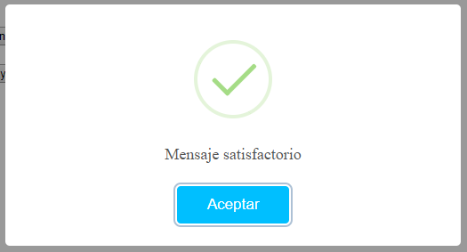

# Descripcion
El código que aquí se presenta pretende ayudar a crear ventanas de alerta utilizando para ello la librería estandar **sweetalert2.min** y que podeis encontrar y profundizar en [SweetAlert 2](https://sweetalert2.github.io).

# Primeros Pasos
1. Tienes que importar estos dos ficheros a tu proyecto:
> * sweetalert2.min. Librería estandar sobre la que nos vamos a apoyar.
> * customalert2.js. Librería personalizada que nos ayudará tan sólo llamando a métodos, a crear ventanas de alerta sin necesidad de tener que replicar constantemente el objeto de sweetalert. Esto facilita la **abstracción** por parte del programador.
2. Ya puedes utilizar los métodos creados para facilitar la abstracción:
> * mensajeSuccess(texto, configuracionUsuario);
> * mensajeError(texto, configuracionUsuario);
> * mensajeInfor(texto, configuracionUsuario);
> * mensajeWarning(texto, configuracionUsuario);
> * crearAlert2(configuracionUsuario);
### mensajeSuccess(texto, configuracionUsuario)
Este método nos mostrará un mensaje con el símbolo de correcto. Para ello le pasaremos el *texto* que queremos que nos muestre y si queremos añadir más opciones rellenaremos un objeto *configuracionUsuario*, que explicaremos más adelante. 

### mensajeError(texto, configuracionUsuario)
Este método nos mostrará un mensaje con el símbolo de error. Para ello le pasaremos el *texto* que queremos que nos muestre y si queremos añadir más opciones rellenaremos un objeto *configuracionUsuario*, que explicaremos más adelante. 

### mensajeInfor(texto, configuracionUsuario)
Este método nos mostrará un mensaje con el símbolo de información. Para ello le pasaremos el *texto* que queremos que nos muestre y si queremos añadir más opciones rellenaremos un objeto *configuracionUsuario*, que explicaremos más adelante. 

### mensajeWarning(texto, configuracionUsuario)
Este método nos mostrará un mensaje con el símbolo de advertencia. Para ello le pasaremos el *texto* que queremos que nos muestre y si queremos añadir más opciones rellenaremos un objeto *configuracionUsuario*, que explicaremos más adelante. 

### crearAlert2(configuracionUsuario)
Este método nos permitirá crear cualquier tipo de mensaje incluido los anteriormente citados. Para ellos le pasaremos un objeto *configuracionUsuario*, que explicaremos en el siguiente punto. 
# Configuracion Usuario
*configuracionUsuario* es un objeto que permite amoldar la ventana de alerta a gusto del programador. En función de lo que quiera mostrar, tendrá que añadir parámetros a dicho objeto(**solamente aquellos que se necesiten**):
> * **icono**: Este parámetro indica que icono lleva el mensaje de alerta. Los valores que **solamente** puede tomar son: 
> 1. *success*: En caso de que queramos mostrar un mensaje que es satisfactorio.
> 2. *error*: En caso de que queramos mostrar un mensaje que es erroneo.
> 3. *info*: En caso de que queramos mostrar un mensaje que es informativo.
> 4. *warning*: En caso de que queramos mostrar un mensaje que es de advertencia.
> **Ejemplo**: {'icono':'success'}.
> * **titulo**: Este parámetro añade un título al mensaje de alerta.
> **Ejemplo**: {'titulo':'Buen Trabajo'}.
> * **texto**: Este parámetro añade el cuerpo al mensaje de alerta.
> **Ejemplo**: {'texto': 'Se ha producido un fallo en el proceso. Contacte con su administrador'}.
